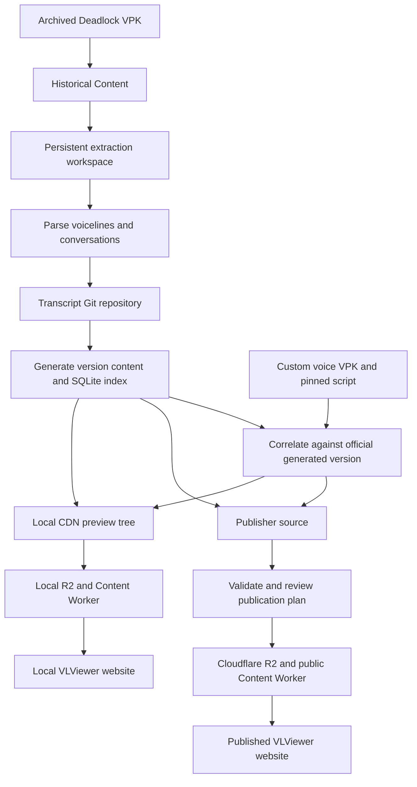

# Historical Content data flow

Historical Content processes one archived Deadlock version at a time, maintains
editable transcripts and configuration, and produces the same content contracts
for local preview and production. The publication dialog is part of the
application. Custom voice mods use a separate deterministic import path against
an official generated version.

## System flow



## Data ownership

Paths below are relative to the configured data directory unless stated otherwise.

| Data | Location | How it is maintained |
| --- | --- | --- |
| Archived game build | Selected archive directory | Original input; keep it available for extraction and verification. |
| Extracted source | `workspaces/<game>/<version>/source/` | Reused when the VPK fingerprint is unchanged. |
| Transcript text and editable configuration | Separate transcript Git repository | Edit, review, and commit corrections here. |
| Local version catalog | `catalogs/<game>.json` | Stores version order, visibility, and latest selection. |
| SQLite index and shared hash store | Configured data directory | Maintained by generation. |
| Local CDN tree | `preview-content/` | Generated content for isolated local R2. |
| Publisher source | `generated/<version>/` | Generated input to validation and publication. |
| Public assets and control JSON | Cloudflare R2 | Updated through publication and version controls. |

Bundled defaults seed editable configuration on first use. Subsequent processing
uses the transcript repository's configuration. Editing generated output is not
a durable way to correct transcripts, categories, or aliases.

Application settings stay in `HistoricalContent/config.json`, and saved OpenAI
credentials stay in `HistoricalContent/credentials.dpapi`. Publisher settings,
credentials, and hash-cache state live in `HistoricalContent/publisher-state/`.
When the publication dialog first opens, migration copies only missing legacy
publisher state and writes a
marker so forgotten credentials are not restored on later launches.

## Process an official version

Launch `historical-content` after following the [installation steps](README.md#install-and-launch).
The Windows launcher remains `HistoricalContent/run_historical_content_gui.bat`.

1. Select Source2Viewer CLI and the archive's `game/citadel/pak01_dir.vpk`.
2. Select the transcript repository and persistent data directory.
3. Enter a stable version ID and display label.
4. Configure transcription options and any predefined official transcript CSV.
5. Select **Process VPK / regenerate content** and wait for **Version ready**.

The application extracts audio into the version workspace, then parses
voicelines and conversations. It reuses a completed extraction with the same VPK
fingerprint. Historical filename rules and character mappings preserve supported
older layouts, including speakerless `rr_test_*` filenames. Mapping changes
require regeneration; they do not require extracting the same audio again.

A prepared source can contain:

```text
workspaces/<game>/<version>/source/
  all_conversations.json
  all_voicelines.json
  coverage.json
  Audio/
  Metadata/
  Localization/
  IconPacks/default/
  CharacterNameImages/
  CharacterSelectBackgrounds/
```

Optional folders depend on the archive and enabled extraction options. Official
subtitle and hero-name text comes from related loose localization files. Image
extraction reads the VPK directly and does not require those loose files.
Portrait variants, localized name images, and character-select backgrounds use
hashed filenames and manifests. Missing historical image variants are omitted.

### Transcripts and audio identity

Generation indexes referenced recordings and computes their SHA-256 hashes.
Official subtitle text, existing transcript revisions, safe CSV matches, and
known identical recordings provide text before a new transcription request is
needed. Effort and known non-speech recordings receive terminal blank transcript
revisions. Completed transcription requests are checkpointed as the batch runs.

Transcript files mirror the audio path, for example:

```text
transcripts/forge/mcginnis_select_01.mp3.json
```

A file's `revisions` array associates text with one or more audio hashes. Text
source authority is `official`, then `manual`, then `generated`. Website grouping
and conversation membership live in generated content rather than transcript
files. See the [transcript guide](README.md#transcript-repository) for correction
rules, blank revisions, and CSV matching.

Generated official lines retain their readable relative `filename` and add
`audioKey` and `duration`. The shared audio key has the form
`sha256/<prefix>/<hash>.mp3`; identical bytes across versions use the same object.
VDF-only phantom entries keep official text with `is_phantom: true` and an empty
filename. They have no audio key, duration, or per-audio transcript file.

### Review local content

Edit categories, display names, aliases, voiceline groups, and filename overrides
in the transcript repository. Game configuration lives under `config/<game>/`;
version overrides live under `config/<game>/versions/<version>/`.

Regenerate after parsing or transcript changes. **Apply categories to preview**
updates category objects without re-indexing audio or requesting transcripts.
Version category overlays can add or reassign characters while preserving the
game defaults.

**Manage local versions...** stores the newest-to-oldest display order and
recalculates adjacent-version recording comparisons. Line identity is the
normalized relative filename; recording identity is its audio hash. Transcript
corrections do not mark a recording modified. `latestVersion` is independent of
the chronology, and hidden versions remain in comparisons.

Select **Seed and start website preview** to seed the generated tree into the
Content Worker's `.wrangler/preview-state`. It starts the Worker at
`http://127.0.0.1:8787` and the configured VLViewer website at
`http://localhost:3000`. This local preview does not use production R2 credentials.
All generated versions in the same workspace remain available in its selector.

## Import a custom voice mod

Use **Import custom voice mod...** or `historical-custom-mod` with a mod VPK,
a pinned VDF/TXT transcript, and an official generated base version. The import
uses Source2Viewer for `sounds/vo`, then correlates full relative audio paths
against the base version. It embeds transcript text and makes no speech-to-text
requests.

The default GUI flow reads transcript provenance from its clean Git checkout and
verifies the selected script and adjacent `metadata.json` against that commit.
The output retains this provenance and a `custom-import-report.json`.

Custom extraction uses its own
`workspaces/<game>/<custom-version>/custom-voice-mod-vpk/` cache. Output audio stays
under the custom version's `Audio/` directory, separate from official shared
audio. Missing transcripts and ambiguous matches produce report warnings; audio
without a safe base record is excluded. Reviewed correlation overrides can
resolve exceptional paths.

Reimporting a custom version replaces that version's local generated and preview
content while protecting official versions. Recovery backups are retained until
the catalog and output updates finish. A custom version can be published and
selected explicitly, but cannot become the game's `latestVersion`.

## Publish reviewed content

Select **Publish / manage versions**. The dialog consumes
`generated/<version>/`; `historical-publish` provides validation, planning, and
publication for automation. See the [publishing reference](../ContentPublisher/README.md)
for credentials, command flags, and source-to-CDN paths.

1. Confirm the source, version metadata, and saved R2/CDN settings.
2. Validate the source and review the remote change plan.
3. Publish hidden for review when appropriate.
4. Test the explicit production version URL.
5. Use the version manager to set visibility, order, and latest selection.

The publisher uploads new binary content, updates mutable JSON, and updates the
game manifest last. Official binary paths are immutable; modified official bytes
need a new object path. Shared audio is reused by hash. Custom version-local audio
can be replaced under the same custom version ID and uses revalidation caching.
Changed JSON and custom-audio URLs are purged when purge credentials are configured.

**Publish multiple...** validates the full selection before the first upload,
publishes oldest-to-newest for shared-audio reuse, then applies the local catalog
order. **Clear game content...** is a separate confirmed reset that deletes only
the selected `<game>/` namespace. It leaves that game's live content unavailable
until publication restores it.

Per-game categories and display names have their own publication actions.
Per-version display-name overlays can be updated separately from audio.
Publication also maintains `<game>/characters.json`, the union used to generate
website routes across published versions. **Refresh character routes** repairs
this index without re-uploading version assets.

## Website consumption

The website requests `<game>/manifest.json` and selects either the URL's explicit
version or `latestVersion`. The manifest supplies content and shared-audio URLs,
version order, visibility, and optional image manifests. Hidden versions are
omitted from the selector but remain accessible by explicit URL.

Game categories and display names are the defaults; version overlays supply
historical differences. Transcript and category corrections update content JSON
without requiring a website deployment. Adding a character absent from the
previous static route export requires rebuilding the website.

## Failure and recovery

| Failure | Recovery |
| --- | --- |
| Extraction is interrupted | Process the same VPK again. A complete matching extraction is reused; an incomplete extraction is replaced. |
| Transcription is interrupted | Regenerate. Completed transcript checkpoints are reused. |
| Category validation fails | Correct the editable JSON and run the category preview update. |
| Local R2 seeding stops | Start preview again; unchanged seeded objects are reused. |
| Publication stops | Review the plan and retry. The game manifest is updated only after content uploads; already-published mutable objects may have changed. |
| Official binary conflict | Use a new object path or version ID for changed bytes. |
| Transcript correction is wrong | Restore the prior transcript revision with Git, regenerate, and republish JSON. |
| Custom reimport stops during replacement | Follow the reported recovery-backup paths before retrying. |

## Current limits and verification

Each official import reads one complete version export. The utility reuses
unchanged extraction workspaces, transcripts, shared audio, and local comparison
data, but does not perform selective extraction from a comparison of two archived
VPK manifests or coordinate a resumable multi-build import.

Regression tests cover parser and localization output using synthetic fixtures
captured before the legacy utilities were removed. Fresh-process checks cover
package imports without Tk or legacy module paths. GUI tests can use Xvfb on
Linux; Windows CI covers DPAPI credential storage. No real archived VPK fixture
is included, so an archived-build smoke test remains part of operator validation.
