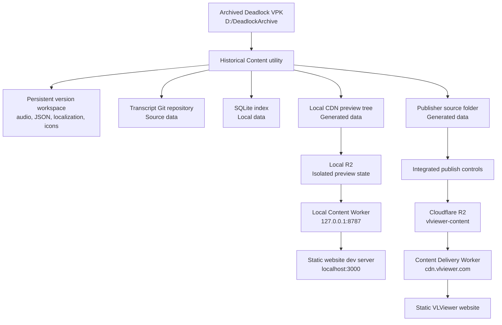
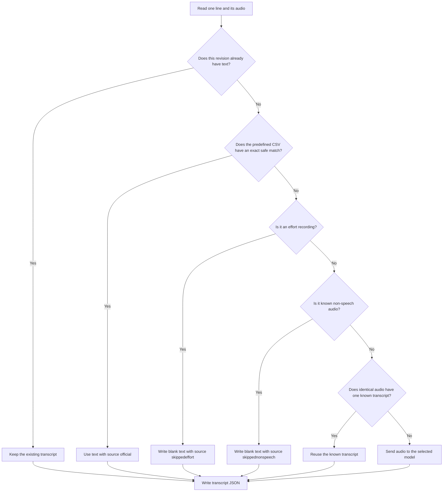
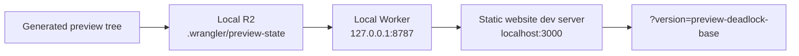
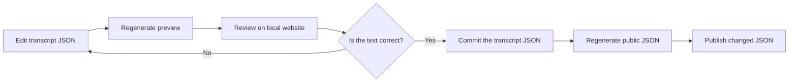
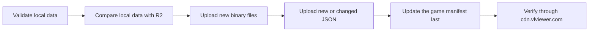
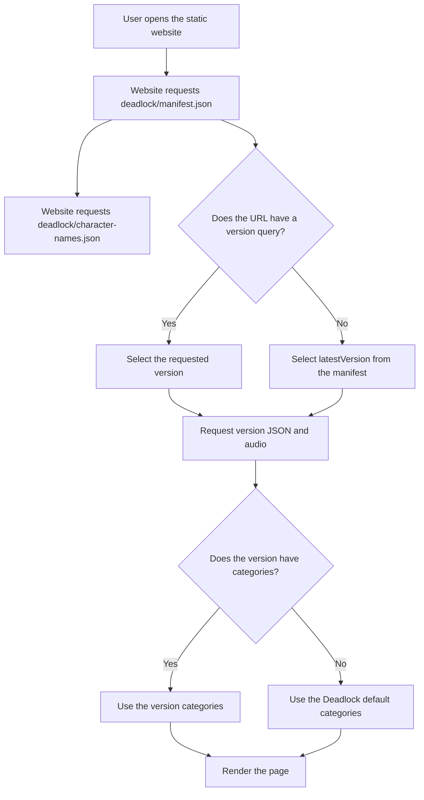
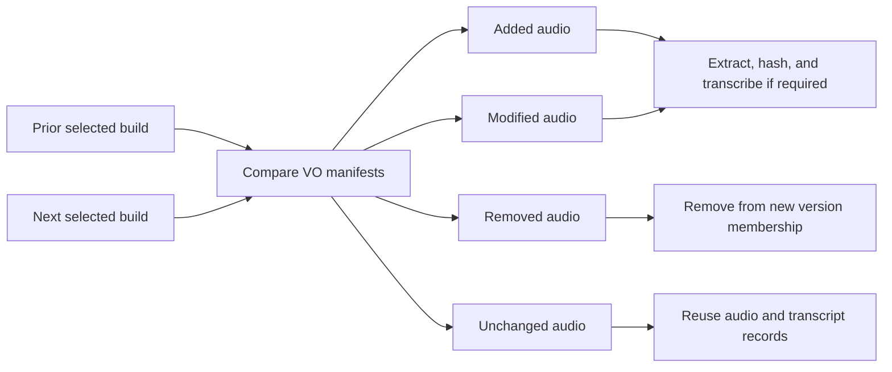

# VLViewer Historical Content: End-to-End Data Flow

## 1. Purpose

This document describes the complete historical content process.

It shows the implemented process and the planned process. It also identifies
the limits of the current tools.

The first processed build is the oldest archived build. This build is the base
version. Process the selected later builds in date order.

## 2. Status terms

- **Implemented** means that the current tools support the function.
- **Planned** means that the function needs more work.
- **Source data** means data that you must keep.
- **Generated data** means data that a tool can make again.

## 3. System flow



## 4. Data ownership

| Data | Location | Type | Rule |
| --- | --- | --- | --- |
| Archived game build | `D:/DeadlockArchive` | Source data | Do not delete it. |
| Version workspace | `D:/VLViewerHistoricalData/workspaces` | Local source data | Historical Content reuses it for the same VPK. |
| Transcript JSON | Separate Git repository | Source data | Edit and commit this data. |
| Categories JSON | Transcript Git repository | Source data | Keep one default file for each game. |
| Character display names JSON | Transcript Git repository | Source data | Keep one alias and display-name map for each game. |
| SQLite index | `D:/VLViewerHistoricalData` | Local data | Back it up before a large change. |
| Preview content | `D:/VLViewerHistoricalData/preview-content` | Generated data | The utility can replace it. |
| Publisher source | `D:/VLViewerHistoricalData/generated` | Generated data | The utility can replace it. |
| Public content | Cloudflare R2 | Published data | Use the publisher to change it. |
| Version manifest | Cloudflare R2 | Published control data | It controls order, visibility, and latest version. |

## 5. Base version process

### 5.1 Select the archived build

1. Select the oldest archived Deadlock build.
2. Record its archive path.
3. Record its Steam build data, if that data is available.
4. Select a stable public version ID.

Example:

```text
deadlock-base
```

Do not change the version ID after publication.

### 5.2 Process the VPK

Start `HistoricalContent/run_historical_content_gui.bat`.

1. Select the Source2Viewer CLI program.
2. Select `game/citadel/pak01_dir.vpk` from the archived build.
3. Select the transcript Git repository.
4. Select the persistent data workspace.
5. Enter the version ID and display label.
6. Select **Process VPK / regenerate content**.

Historical Content extracts the audio directly into the persistent version
workspace. It does not start All-in-One and it does not make a temporary audio
copy. A rerun with the same VPK fingerprint uses the existing extraction.

The version source has this structure:

```text
<data-dir>/workspaces/deadlock/<version>/source/
  all_conversations.json
  all_voicelines.json
  coverage.json
  Audio/
  Localization/
  FanLocalization/
  IconPacks/default/
  CharacterSelectBackgrounds/
```

Historical Content reads official VDF subtitle text when the related archived
game directory contains it. It marks this text as official.

You can also select a **Predefined official transcripts CSV** in the same GUI.
This source supplies official localization text for recordings shared with a
newer game build. The selection is optional and is saved with the other local
settings.

Some old builds use `rr_test_<number>_<event>.mp3` names. These names do not
contain a speaker. Historical Content uses the first folder below `sounds/vo`
as the speaker alias. It applies `character-mappings.json` to that alias. If
the current topic parser cannot read the old event name, the utility keeps the
file as a `Self` topic. It does not discard the file.

VDF-only phantom lines contain official text without audio. The utility keeps
these lines in the generated content JSON, but it does not create per-audio
transcript files, hashes, durations, asset rows, or recording-comparison state
for them. Only records explicitly marked `is_phantom: true` can omit the
filename.

Historical Content also extracts the `*_mm` and `*_sm` hero images from the
VPK. It reads `scripts/heroes.vdata` from the same build to connect each hero
to the correct historical image. It writes the result as the version's
`IconPacks/default` override. This step does not need loose localization files.

It also extracts character-select background textures, crops the consistently
unused left half, packages hashed WebPs, and expands their lookup manifest with
the same `character-mappings.json` aliases as portraits. Each manifest asset
also includes its precomputed UI accent color. The version publisher
serves these as `character-select-backgrounds/` and advertises the manifest as
`characterSelectBackgroundsUrl`.

### 5.3 Generate transcripts and website data

The same **Process VPK / regenerate content** action continues from mining into
transcript and website generation. Select the transcription model and enter an
OpenAI API key before you start when text is missing.

The utility does these tasks:

1. It runs or resumes Source2Viewer.
2. It parses conversations without the conversation GUI.
3. It parses voicelines and applies the JSON group configuration.
4. It indexes each referenced audio file.
5. It calculates the SHA-256 value of each referenced audio file.
6. It reads official and existing transcript text.
7. It applies safe exact-path matches from the optional predefined transcript
   CSV to revisions that are still blank.
8. It writes effort recordings with `source: "skippedeffort"` and known
   non-speech recordings with `source: "skippednonspeech"`. It does not send
   these recordings to the transcription model.
9. It reuses text for identical audio.
10. It sends the remaining audio to the selected model. A blank model response
   is stored as `skippednonspeech` and is not submitted again on later runs.
11. It writes readable transcript JSON and category files.
12. It writes the SQLite index.
13. It makes the local preview tree and publisher source folder.

The utility uses this transcript decision:



For predefined transcript CSV input, the utility removes the `sounds/vo/`
prefix, changes `.vsnd_c` to `.mp3`, normalizes path separators, and then
matches the complete path case-insensitively. It accepts `single_match` and
`multiple_keys_same_transcription`. It skips
`multiple_conflicting_transcriptions`; it never writes joined alternatives
such as `First text || Second text` into a transcript.

The transcript key contains the relative audio path and the audio SHA-256
value. The repository uses one small JSON file for each audio path. Each
revision shares one subtitle across an array of matching SHA-256 values.
Matching ignores case, punctuation, and whitespace. Voicelines and conversation
lines use this same format. Website grouping data is not stored with transcript
text.

### 5.4 Review categories

The transcript repository contains these category files:

```text
config/deadlock/categories.json
config/deadlock/versions/deadlock-base/categories.json
```

The first file is the default for the Deadlock game. The second file is an
overlay for one version. The website loads both documents. Version entries add
to the global structure, and listing a character under another category
reassigns that character for the selected version.

1. Select **Open categories.json**.
2. Edit the category order and character lists.
3. Save the JSON file.
4. Select **Validate categories**.
5. Correct each reported error.
6. Select **Apply categories to preview**.

The category update does not hash audio again. It does not run transcription
again.

### 5.5 Review character display names

The transcript repository contains this per-game file:

```text
config/deadlock/character-names.json
```

1. Select **Open display names**.
2. Edit internal-name or alias keys and their display names.
3. Save valid JSON.
4. Regenerate content.

Generation copies the document to the local CDN preview and the publisher
source. It is the per-game default.

A version may also contain a partial overlay:

```text
config/deadlock/versions/deadlock-base/character-names.json
```

Generation places this document in the version preview and publisher source.
Publication uploads it below that version and adds `characterNamesUrl` to the
version manifest entry. Omit it when the version uses the game-wide names.

### 5.6 Preview the version

Select **Seed and start website preview**.



The utility stores local order in `<data-dir>/catalogs/<game>.json`. Use
**Manage local versions...** to order versions newest-to-oldest and select an
independent default. Saving the catalog recalculates voiceline differences:
new or modified compared with the adjacent older version, and removed in the
adjacent newer version.

The preview process does not use Cloudflare credentials. It does not change
the production R2 bucket. The website gets all version content at run time.

Review these items:

- The version label is correct.
- The categories are correct.
- Each character is in the correct category.
- Conversations have the correct order.
- Transcript text is correct.
- Audio playback is correct.
- Localization is correct.
- Coverage data is correct.
- Icon overrides are correct.
- Missing pages show the unavailable-version message.

## 6. Transcript correction process

The transcript Git repository is the source for transcript text.

1. Find the JSON file that mirrors the relative audio path.
2. Find the revision with the applicable `sha256` value.
3. Change the `text` value.
4. Set `source` to `manual`.
5. Remove the `model` field.
6. Save the JSON file.
7. Regenerate the preview.
8. Review the line on the website.
9. Commit the correction after the review.



A transcript correction does not change the public version ID. It does not
require a new audio upload.

## 7. Production publication

The Historical Content utility makes this folder:

```text
D:/VLViewerHistoricalData/generated/deadlock-base/
```

Select **Publish / manage versions** in Historical Content.

For a multi-version release, select **Publish multiple...**, choose generated
versions from the local catalog, and choose whether they remain hidden for
review. All selected sources are validated first. Publication then runs
oldest-to-newest for shared-audio reuse and finishes by applying the local
newest-to-oldest manifest order.

If the public format must be reset, use **Clear game content...** immediately
before the bulk publication. This deletes only `<game>/`, verifies that the
prefix is empty, and preserves other game prefixes in the bucket. The action
requires two confirmations, including typing the game ID.

1. Confirm the saved R2 and CDN settings.
2. Keep the first publication hidden.
3. Validate the local content.
4. Make the remote change plan.
5. Review all conflicts and uploads.
6. Publish the version.
7. Test the explicit production version URL.
8. Open **Manage versions**.
9. Make the version visible after the test.
10. Set its order.
11. Set it as latest only when required.

Normal version publication publishes `character-names.json` before it updates
the manifest. To change display names without publishing a version, use
**Publish game display names**. The production endpoint must exist before a
static website build starts.

The publisher uses this order:



Binary files are immutable at an existing public path. New binary files are
permitted. JSON files are mutable. The publisher can upload transcript
corrections to the same version ID.

The public Worker serves this path:

```text
https://cdn.vlviewer.com/deadlock/...
```

The game ID is the first path element. This path works for
`beta.deadlock.vlviewer.com` because the website and content hosts are
independent.

## 8. Website run-time process

The static website does not contain a hard-coded default version.



The manifest controls the version order, hidden state, and latest version. A
hidden version does not appear in the normal selector. An explicit version URL
can still load it.

If a page is absent from the selected version, the website shows **Not
available in this version**. The user can select the latest version.

## 9. Later historical versions

The target process compares each selected build with the prior selected build.



This full delta process is **planned**. The current Historical Content utility
implements the complete base-version process. It does not yet implement these
functions:

- Automatic comparison of two archived VPK manifests.
- Extraction of added and modified audio only.
- A full SQLite membership map for all historical versions.
- A query that finds all versions affected by one correction.
- Resume data for an interrupted multi-build import.
- One-button import of all selected historical builds.

Do not use the current base generator as the final 35-build importer. It reads
one complete version export at a time. It can do unnecessary work for later
versions.

## 10. Shared production audio

Generated lines retain their readable `filename` and add `audioKey`. Audio is
stored once at `deadlock/audio/sha256/<prefix>/<hash>.mp3`. The publisher lists
existing game-level objects while planning and uploads only missing hashes.
Legacy version-scoped audio remains readable but is not used by newly generated
versions.

Generated voiceline and conversation line objects also contain `duration` in
seconds, rounded to milliseconds. The website uses this value immediately and
loads media metadata only for older content that does not have it.

## 11. Failure and recovery

### Source2Viewer or Historical Content stops during extraction

Run **Process VPK / regenerate content** again. Historical Content keeps the
version workspace. It replaces an incomplete extraction, or reuses a completed
extraction when the VPK fingerprint is unchanged.

### Transcription stops

Run **Process VPK / regenerate content** again. It reuses transcript entries
that already exist.

### Category validation fails

Correct the category JSON. Use the category-only preview update.

### Publication stops before the manifest update

The public manifest still points to the prior complete state. Run the publisher
again.

### A binary conflict occurs

Do not overwrite the public binary. Use a new object path or a new version ID.

### A transcript correction is incorrect

Restore the prior JSON text with Git. Regenerate and publish the JSON again.

## 12. Review decisions

Confirm these decisions before the full historical import:

1. Confirm the public version ID format.
2. Confirm the metadata for the oldest build.
3. Confirm the remote location of the transcript Git repository.
4. Confirm the default Deadlock categories.
5. Confirm the audio conversion settings.
6. Confirm the Source2Viewer program that Historical Content must control.
7. Confirm the shared SHA-256 audio layout before backfill.
8. Confirm the first visible historical versions.
9. Confirm which version becomes latest after the backfill.

## 13. Recommended next implementation step

VPK intake, persistent extraction, headless parsing, transcript generation,
multi-version local preview, shared-audio publication, and catalog controls are
now in the one utility. Automated post-publication verification and
chronological delta extraction are the next integration.

See [VPK_TO_PUBLISH_PIPELINE_PLAN.md](VPK_TO_PUBLISH_PIPELINE_PLAN.md). Complete
the chronological comparison work before the import of the 34 tracked builds.
