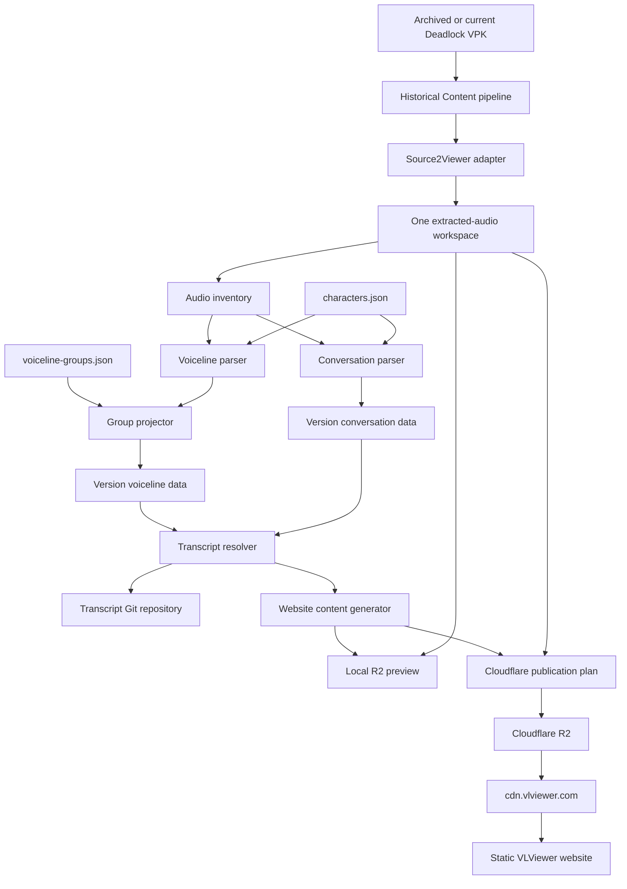
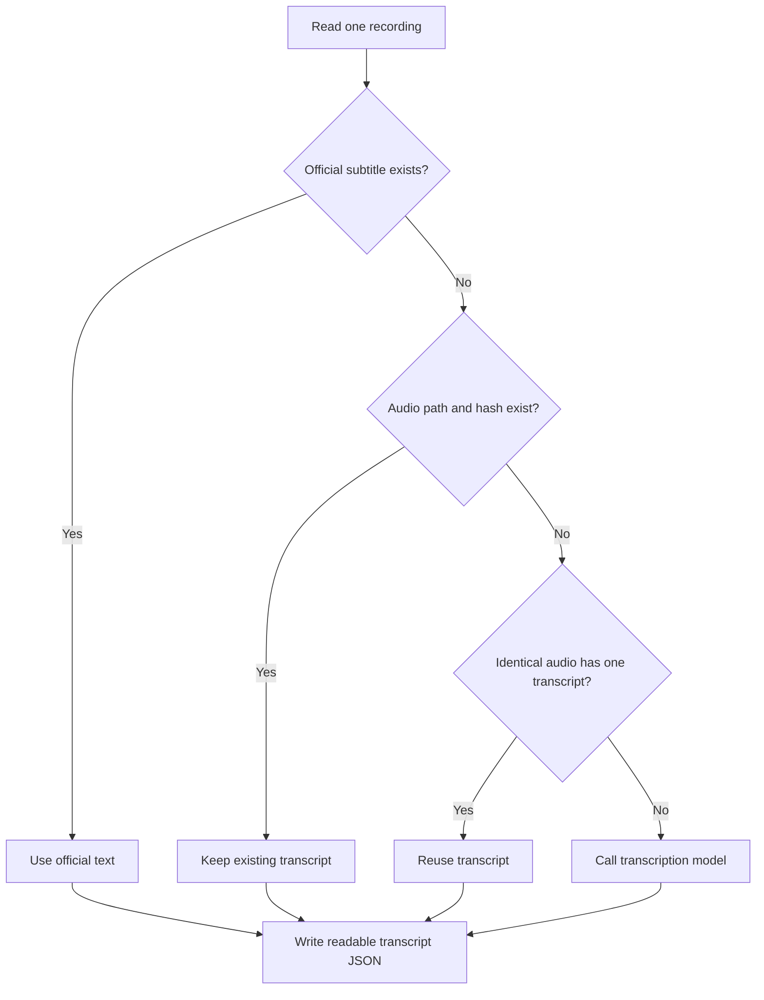
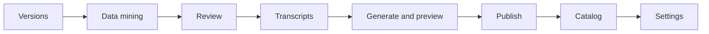

# Historical Content: VPK-to-Publish Pipeline Plan

## 1. Decision

Extend the existing Historical Content utility. Do not make a separate Version
Exporter application.

The user must select one VPK and enter the version data. Historical Content
must then control all stages from data mining through publication.

The application must have modular internal code. It must not become one large
GUI file. One application and separate internal modules give the best operator
process and the best test structure.

### Implemented foundation

The voiceline grouping migration is complete. `Assets/voiceline_groups.json`
seeds `config/<game>/voiceline-groups.json` in the transcript repository.
Historical Content loads the repository copy at run time. The standalone
Voiceline Organizer and the legacy All-in-One utility can also load the JSON
for parity tests. The old group dictionaries and special route meanings are no
longer stored in Python.

The first local-preview slice is also implemented. Historical Content accepts
the VPK, runs Source2Viewer into a persistent version workspace, parses
conversations headlessly, applies voiceline group JSON, generates or reuses
transcripts, and produces the local preview source without an All-in-One step.

The existing publisher core is available from **Publish / manage versions** in
the same Historical Content application. It supports local validation, R2
connection tests, dry-run comparison, hidden publication, game-default
categories, visibility, order, and latest-version changes. Automated production
URL verification remains unfinished. Shared cross-version audio objects and a
cumulative multi-version local preview are implemented.

The future Historical Content integration must reuse this JSON contract. It can
later move the canonical file into the transcript repository, but it must not
add a second hard-coded copy.

## 2. Operator goal

The complete process must be:


The user must not do these manual tasks:

- Start the All-in-One utility.
- Set separate output paths.
- Move processed audio files.
- Start a separate conversation utility.
- Start a separate voiceline utility.
- Start Content Publisher for a normal version import.
- Copy audio between working folders.

## 3. Application boundary

Historical Content must own these functions:

- Version registration.
- VPK validation.
- Source2Viewer control.
- Persistent extraction workspaces.
- Audio inventory.
- Character mapping.
- Voiceline parsing.
- Voiceline group assignment.
- Conversation parsing.
- VDF and official subtitle parsing.
- Localization extraction.
- Icon extraction and overrides.
- Coverage generation.
- Transcript reuse and generation.
- Transcript correction preview.
- Website content generation.
- Local R2 preview.
- Cloudflare R2 publication.
- Hidden version publication.
- Version visibility, order, and latest-version control.

The static website and the Content Delivery Worker remain separate deployed
systems. Historical Content controls the data that they use.

## 4. Data flow



## 5. No-copy audio rule

Source2Viewer must extract audio one time into a persistent version workspace.
All later stages must read those files directly.

The application must not make an export `Audio` folder. It must not make a
publisher `Audio` folder. It must not make a transcription copy folder.

Source2Viewer must still write audio to disk. Transcription, preview, and
publication require the audio bytes. The no-copy rule removes duplicate local
files. It does not remove the extraction or R2 upload.

Use this workspace:

```text
D:/VLViewerHistoricalData/work/<version-id>/
  extracted/
    sounds/vo/
  intermediate/
  generated/
  logs/
```

The preview seeder must read audio from `extracted/sounds/vo`. The production
publisher must upload from the same path.

The application can delete the extracted workspace after successful
publication. This cleanup must be optional. The archived VPK remains the
recoverable source.

## 6. Proposed project structure

Refactor the existing project to this structure:

```text
HistoricalContent/
  historical_content/
    app/
      gui.py
      state.py
    pipeline/
      coordinator.py
      stages.py
      cancellation.py
    mining/
      source2viewer.py
      vpk_validation.py
      audio_inventory.py
      localization.py
      icons.py
      vdf.py
    configuration/
      characters.py
      groups.py
      categories.py
      schemas.py
    voicelines/
      parser.py
      records.py
      grouping.py
    conversations/
      parser.py
      records.py
    transcripts/
      repository.py
      resolver.py
      transcription.py
      validation.py
    generation/
      website_data.py
      coverage.py
      asset_map.py
    preview/
      local_r2.py
      processes.py
    publishing/
      planner.py
      uploader.py
      catalog.py
      verification.py
    database/
      schema.py
      migrations.py
      ledger.py
  schemas/
  tests/
  run_historical_content_gui.bat
```

The GUI must call the pipeline coordinator. It must not contain parser,
transcription, or publisher logic.

## 7. Version input

The first page must contain these fields:

- VPK path.
- Game ID.
- Version ID.
- Display label.
- Version date.
- Archive path.
- Steam build ID, if known.
- GameTracking commit, if known.
- Hidden state.
- Workspace root.

Use these defaults:

- Game ID: `deadlock`.
- Hidden state: enabled.
- Workspace root: `D:/VLViewerHistoricalData`.
- Transcript model: `gpt-4o-transcribe`.

The user selects only the main VPK. The application must find the related game
paths when possible. It must show each path before extraction starts.

## 8. Pipeline stages

### Stage 1: Validate

The application must:

1. Validate the VPK path.
2. Validate the version ID.
3. Validate the game configuration.
4. Validate the Source2Viewer program.
5. Check the workspace path.
6. Check available disk space.
7. Check that the version ID does not conflict with another game state.
8. Show a validation report.

Validation must not extract audio or call an external API.

### Stage 2: Register the version

Write the version to SQLite. Use `pending` as the first import state.

Store:

- Game ID.
- Version ID.
- Display label.
- Version date.
- VPK path and fingerprint.
- Archive path.
- Steam metadata.
- GameTracking metadata.
- Hidden state.
- Display order.
- Current pipeline stage.

### Stage 3: Mine the VPK

Historical Content must start Source2Viewer as a child process. The GUI must
show its progress and log output.

Extract these resources:

- Voice audio.
- Generated VO VDF data.
- Localization files.
- Hero name localization.
- Default hero icons.
- Other configured icon overrides.

Write audio directly to the version workspace. Do not copy it after extraction.

Store a VPK fingerprint and an extraction completion marker. Reuse the
extraction when the VPK fingerprint is unchanged.

### Stage 4: Build the inventory

Create one audio inventory with relative paths, basenames, sizes, and modified
times.

Use relative paths as the primary file identity. Do not use a basename as the
primary identity. Report duplicate basenames.

Calculate SHA-256 only when Historical Content needs a recording identity or
an upload key. Cache each calculated hash in SQLite.

### Stage 5: Parse voicelines

The parser must make group-neutral records.

Example:

```json
{
  "lineId": "astro_match_start_01",
  "relativeAudioPath": "holliday/astro_match_start_01.mp3",
  "speakerId": "holliday",
  "subjectId": "self",
  "topicId": "match_start",
  "topicLabel": "Match start",
  "isPing": false,
  "officialSubtitle": null
}
```

The parser must not contain display group lists. A change to a display group
must not run the parser again.

Move proven filename rules from the existing organizer into headless functions.
Protect each rule with a test.

### Stage 6: Parse conversations

Move the conversation parser into Historical Content.

The parser must not instantiate `ConversationPlayer`. It must not import
Tkinter, Pygame, or OpenAI.

Reuse these proven rules:

- Conversation ID construction.
- Part and variation detection.
- Speaker detection.
- Conversation completion checks.
- VDF subtitle merge.
- Phantom-line detection.

The conversation parser and voiceline parser must use the same character
mapping service.

### Stage 7: Review mappings and groups

Stop before transcription when the parser finds unresolved character aliases,
ambiguous audio paths, or invalid group rules.

The user can correct a configuration file and rerun only the affected parser
stage.

### Stage 8: Resolve transcripts

Use this order:



Do not overwrite manual or official text. Save successful transcription results
in small batches. A stopped run must resume without another API call for saved
items.

Store all individual recordings in one transcript tree. Mirror the relative
audio folders and use `<audio-filename>.json`. Do not split conversation lines
from voicelines. Each file keeps a revision for every distinct SHA-256 value.
Do not store website locations, categories, speakers, or conversation membership
in transcript JSON.

### Stage 9: Generate website content

Combine these inputs:

- Version membership from SQLite.
- Transcript text from the Git repository.
- Voiceline groups from configuration.
- Character categories from configuration.
- Conversation records.
- Localization.
- Coverage.
- Icon overrides.
- Audio object keys.

Generate the same website data for local preview and production publication.
Only the content origin can change.

### Stage 10: Preview locally

Seed isolated local R2. Start the local Content Delivery Worker and the static
website dev server.

Open:

```text
http://localhost:3000/?version=preview-<version-id>
```

Preview must not require Cloudflare credentials. It must not access production
R2.

### Stage 11: Make the publication plan

Compare generated content with Cloudflare R2. Show:

- New audio objects.
- Existing audio objects.
- New JSON objects.
- Changed mutable JSON.
- Binary conflicts.
- Upload count.
- Upload byte total.
- Manifest changes.
- Hidden state.
- Display order.
- Latest-version change.

This stage must not change production data.

### Stage 12: Publish hidden

Use hidden publication as the default.

Publish in this order:

1. Upload missing immutable audio.
2. Upload generated content.
3. Verify all referenced objects.
4. Update the version record or pointer.
5. Update the game manifest last.
6. Purge changed mutable JSON when required.

If the process stops before the pointer or manifest update, the public website
must continue to use the prior complete state.

### Stage 13: Verify production

Test the explicit production URL for the hidden version.

Verify:

- Manifest response.
- Version JSON response.
- Conversation pages.
- Voiceline pages.
- Audio range requests.
- Localization.
- Categories and groups.
- Icons.
- Coverage.

### Stage 14: Manage the catalog

The same GUI must permit these changes without another content upload:

- Hide or show a version.
- Move a version up or down.
- Set any visible version as latest.
- Publish the game-level default categories.

## 9. Character mapping configuration

Store this file in the transcript Git repository:

```text
config/deadlock/characters.json
```

Recommended contract:

```json
{
  "schemaVersion": 1,
  "characters": [
    {
      "id": "holliday",
      "label": "Holliday",
      "aliases": ["holliday", "astro"],
      "enabled": true
    },
    {
      "id": "mo-and-krill",
      "label": "Mo & Krill",
      "aliases": ["mo&krill", "digger", "krill"],
      "enabled": true
    }
  ],
  "ignoredAliases": []
}
```

Validation rules:

- A character ID must be unique.
- A normalized alias must map to one character only.
- A display label must not control identity.
- An unknown alias must appear in the review list.
- Both parsers must output the canonical character ID.

The GUI must provide **Open character mappings** and **Reload mappings**
actions. A structured mapping editor can come later.

## 10. Voiceline group configuration

All group definitions must move from Python to JSON. Python can contain the
generic matching engine. It must not contain group names, topic lists, group
order, or game-specific routing rules.

Store the JSON file in the transcript Git repository:

```text
config/deadlock/voiceline-groups.json
```

Recommended contract:

```json
{
  "schemaVersion": 1,
  "unmatched": {
    "voice": "keep-topic-at-root",
    "ping": "keep-topic-at-pings-root"
  },
  "rootTopicOrder": ["select", "unselect", "pre_game", "post_game"],
  "groups": [
    {
      "id": "item-usage",
      "label": "Item Usage",
      "scope": "voice",
      "match": {
        "topics": [],
        "prefixes": ["use_"],
        "excludePrefixes": ["use_power"]
      },
      "subgroups": []
    },
    {
      "id": "combat",
      "label": "Combat",
      "scope": "voice",
      "match": {
        "topics": ["kill", "parry", "revenge_kill"],
        "prefixes": ["killstreak_"],
        "excludePrefixes": []
      },
      "subgroups": []
    },
    {
      "id": "emotions",
      "label": "Emotions",
      "scope": "voice",
      "match": {
        "topics": ["angry", "happy", "sad"],
        "prefixes": [],
        "excludePrefixes": []
      },
      "subgroups": [
        {
          "id": "pain",
          "label": "Pain",
          "match": {
            "topics": ["pain"],
            "prefixes": ["pain_"],
            "excludePrefixes": []
          }
        },
        {
          "id": "effort",
          "label": "Effort",
          "match": {
            "topics": ["effort"],
            "prefixes": ["effort_"],
            "excludePrefixes": []
          }
        }
      ]
    },
    {
      "id": "objective-commands",
      "label": "Objective Commands",
      "scope": "ping",
      "match": {
        "topics": ["attack_enemy", "defend_base"],
        "prefixes": [],
        "excludePrefixes": []
      },
      "subgroups": []
    }
  ],
  "overrides": []
}
```

The canonical `Assets/voiceline_groups.json` contains the complete current topic
lists that were migrated from both former Python dictionaries.

The `scope` field separates normal voicelines from pings. The array order is the
website display order. Use stable group IDs. A label can change without an
identity change.

The initial JSON must preserve the present output. Unmatched normal topics must
stay at the subject root. Unmatched ping topics must stay under the `Pings`
root. A later JSON edit can change this behavior.

Use this match order:

1. Filename override.
2. Exact subgroup topic.
3. Exact group topic.
4. Longest subgroup prefix.
5. Longest group prefix.
6. Configured unmatched behavior.

Reject duplicate exact assignments. Report overlapping prefixes. Do not use
regular expressions in the first version.

### Required code-to-JSON migration

The completed migration moved all these definitions to
`Assets/voiceline_groups.json`:

- `VoiceLineOrganizer.special_categories`.
- `VoiceLineOrganizer.special_ping_categories`.
- The `use_*` to `Item Usage` rule.
- The `pain*` to `Emotions/Pain` rule.
- The `effort*` to `Emotions/Effort` rule.
- The special group display order.
- The root topic priority order.

These definitions were removed from `voice_line_organizer.py`. Do not add a
second default copy in Python.

The generic group engine can understand these fields:

- `scope`.
- `topics`.
- `prefixes`.
- `excludePrefixes`.
- `subgroups`.
- `overrides`.
- Array order.
- Unmatched behavior.

The engine must not understand the meanings of Combat, Emotions, Pain, Item
Usage, or any other Deadlock group.

### Migration validation

Run the old organizer and the new JSON group engine on the same fixture. Compare
the complete output path for each voiceline.

The migration passes only when:

- Every old main group exists in JSON.
- Every old ping group exists in JSON.
- Every old topic assignment has the same output path.
- Every special prefix rule has the same output path.
- Group order is unchanged.
- Unmatched-topic behavior is unchanged.

## 11. Groups page

Add a **Voiceline groups** page to Historical Content.

Show:

- Ordered groups.
- Subgroups.
- Assigned topics.
- Unassigned topics from the selected version.
- Rule conflicts.
- Voiceline count for each group.
- A preview of the generated tree.

Provide:

- Add group.
- Rename group label.
- Move group up or down.
- Add subgroup.
- Move selected topics.
- Save configuration.
- Validate configuration.
- Regenerate group output only.

A group edit must not extract, parse, hash, or transcribe audio again.

## 12. GUI layout

Use one window with these main pages:



### Versions

Register a VPK and show the pipeline state for each version.

### Data mining

Show Source2Viewer progress, extracted file counts, and parser stages.

### Review

Show unknown aliases, ambiguous files, conversation problems, and voiceline
groups.

### Transcripts

Show missing items, model selection, progress, failures, search, and correction.

### Generate and preview

Generate content, seed local R2, start local services, and open the website.

### Publish

Test credentials, show the publication plan, publish hidden, and verify.

### Catalog

Manage hidden state, order, latest version, and default categories.

### Settings

Configure Source2Viewer, workspace, transcript repository, website, Worker,
OpenAI credentials, Cloudflare credentials, concurrency, and cleanup.

## 13. Pipeline state and resume

Store stage state in SQLite. Do not rely only on files that exist.

Recommended states:

```text
pending
validated
extracted
inventoried
parsed
review-required
transcribed
generated
previewed
publish-planned
published-hidden
verified
visible
```

Store an input fingerprint for each stage.

- A group change invalidates generation and later stages only.
- A character mapping change invalidates parsing and later stages.
- A VDF change invalidates parsing and later stages.
- A transcript change invalidates generation and later stages.
- A VPK change invalidates extraction and all later stages.

Each stage must be safe to run again. Write JSON to a temporary file. Replace
the final file only after validation succeeds.

## 14. SQLite expansion

Keep transcript text out of SQLite. Git remains the transcript source.

Add or expand these tables:

- `versions` for version identity and pipeline state.
- `source_files` for VPK file inventory and fingerprints.
- `recordings` for audio hashes and source paths.
- `version_assets` for version membership.
- `conversation_lines` for conversation membership and order.
- `uploads` for R2 object state.
- `pipeline_runs` for stage progress and errors.

This data permits a later version to reuse unchanged recordings and
transcripts from the prior selected version.

## 15. Production audio layout

Historical Content now uses shared SHA-256 audio objects:

```text
deadlock/audio/sha256/<first-two>/<full-sha256>.mp3
```

This design prevents an R2 audio copy for each version. Generated lines contain
`audioKey`; the game manifest contains `sharedAudioBaseUrl`; and the website
falls back to the legacy version `audioBaseUrl` for older content.

### Compatibility step

Publish through the current version-path contract. Read local audio directly
from the extraction workspace. Do not make local copies.

### Shared-audio step (implemented)

Add audio object keys to generated line data. Update the website loader and
publisher. Publish one hash-addressed R2 object for identical audio across all
versions.

The publisher reuses an existing object key across versions and never replaces
or automatically deletes a shared immutable object.

## 16. Code reuse

Reuse code, but move it behind headless interfaces.

### Reuse from All-in-One

- Source2Viewer command construction.
- Localization extraction.
- Icon extraction.
- Status-file parsing, if still required.

### Reuse from Voiceline Utilities

- Filename parsing rules.
- Topic normalization.
- VDF filename matching.

Do not reuse hard-coded group dictionaries. Convert them to JSON once.

### Reuse from Conversation Utilities

- Conversation filename rules.
- Part and variation rules.
- VDF merge rules.
- Phantom-line rules.

Do not reuse the Tkinter player class as the parser.

### Reuse from Historical Content

- Transcript repository format.
- Exact-audio transcript reuse.
- OpenAI transcription.
- DPAPI credential storage.
- Category validation.
- Local preview process control.

### Reuse from Content Publisher

- R2 comparison.
- Binary conflict checks.
- JSON mutation rules.
- Credential storage.
- Cache purge.
- Manifest publication order.
- Catalog management.

Move publisher logic into a reusable library. The Historical Content GUI can
call this library.

## 17. Implementation phases

### Phase 1: Configuration and contracts

- Add `characters.json`.
- Add `voiceline-groups.json`.
- Convert the current aliases and hard-coded groups.
- Add JSON schemas and validation.
- Define group-neutral record models.

### Phase 2: VPK intake and workspace

- Add the VPK page.
- Add Source2Viewer control.
- Add the persistent extraction workspace.
- Add VPK fingerprints and stage state.
- Remove the manual audio-move requirement.

### Phase 3: Headless parsers

- Extract the voiceline parser.
- Extract the conversation parser.
- Add the common character mapping service.
- Add VDF and phantom lines.
- Add golden-file tests.

### Phase 4: Groups page

- Add group validation.
- Add unassigned-topic reports.
- Add the group editor.
- Regenerate voiceline output without earlier stages.

### Phase 5: Transcript and generation integration

- Feed parser records directly into transcript resolution.
- Preserve all historical audio-path and SHA-256 revisions in Git.
- Expand the SQLite membership ledger.
- Generate compatible website JSON.

### Phase 6: Integrated preview

- Seed local R2 from external audio paths.
- Start the Worker and website.
- Preview the selected VPK version.
- Preview uncommitted transcript and group edits.

### Phase 7: Integrated publication

- Move Content Publisher core into a reusable package.
- Add the Publish page.
- Publish hidden by default.
- Add production verification.
- Add Catalog management.

### Phase 8: Shared production audio

- [x] Add hash-addressed audio objects.
- [x] Update the generated content contract.
- [x] Update the website audio resolver.
- [x] Update local preview and production publication.
- [x] Prove cross-version audio reuse with regression tests.

### Phase 9: Historical backfill

- Process the older pre-tracker VPK first.
- Preview and publish the base hidden.
- Process the 34 tracked builds in chronological order.
- Reuse unchanged recordings and transcripts.
- Expose selected versions after review.

## 18. Migration plan

1. Keep the current Historical Content baseline flow working.
2. Keep All-in-One and Content Publisher available for rollback.
3. Add VPK intake behind a feature flag.
4. Compare new parser output with the existing utilities.
5. Use one current VPK as the first parity test.
6. Use the oldest archived VPK as the second parity test.
7. Correct all unexplained differences.
8. Use the integrated process for the base version.
9. Remove the feature flag after the base preview passes.
10. Deprecate All-in-One after one later version passes.
11. Keep the separate publisher GUI until integrated publication passes.
12. Retire the old GUIs only after production verification succeeds.

## 19. Test plan

### VPK and extraction tests

- Reject an invalid VPK.
- Reuse an unchanged complete extraction.
- Resume after a stopped extraction.
- Confirm that no audio copy folder exists.

### Character mapping tests

- Reject duplicate aliases.
- Resolve multi-part aliases.
- Report an unknown alias.
- Produce the same character IDs in both parsers.

### Voiceline tests

- Test each known filename pattern.
- Test exact group matches.
- Test prefix group matches.
- Reject duplicate group assignments.
- Regenerate groups without audio access.

### Conversation tests

- Test stable conversation IDs.
- Test parts and variations.
- Test official VDF text.
- Test phantom lines.
- Test incomplete conversations.

### Transcript tests

- Preserve manual text.
- Preserve official text.
- Reuse the same audio path and hash.
- Reuse identical audio at another line.
- Preserve an older revision when audio changes at the same path.
- Resume a stopped transcription run.

### Preview tests

- Seed isolated local R2 from the extraction workspace.
- Load the version with a query parameter.
- Play audio.
- Apply group and transcript edits without a site rebuild.

### Publication tests

- Make a read-only plan.
- Skip an unchanged object.
- Block a changed binary at an immutable path.
- Upload JSON changes to an existing version.
- Update the manifest last.
- Publish hidden.
- Promote an existing visible version.

## 20. Acceptance criteria

The integrated pipeline is ready when all these statements are true:

- The user selects one VPK in Historical Content.
- The application mines all required game data.
- The application does not require All-in-One.
- The application does not copy audio between local working folders.
- The application parses voicelines and conversations.
- Both parsers use one character mapping file.
- Voiceline groups are editable outside Python code.
- A group edit reruns generation only.
- The application generates or reuses all transcript text.
- The application opens a complete local website preview.
- The application makes a production publication plan.
- The application publishes a hidden version.
- The application verifies the hidden production version.
- The application changes visibility, order, and latest version.
- A stopped run can resume.
- The base VPK and one later VPK pass parity tests.

## 21. Recommended first slice

Implement VPK-to-local-preview before integrated production publication.

The first slice must:

1. Accept a VPK and version data.
2. Run Source2Viewer into one persistent workspace.
3. Build the audio inventory.
4. Parse voicelines and conversations without the old GUIs.
5. Read external character and group configuration.
6. Generate or reuse transcripts.
7. Generate website data.
8. Start the local website preview.
9. Make no local audio copies.

The existing publisher core is now hosted by Historical Content, and shared
cross-version audio is implemented. The next work is automated production
verification, group-only regeneration, and chronological delta extraction.
Test the mining output against one current and one archived VPK before the
historical backfill.

## 22. Decisions for review

The plan uses these recommended decisions:

1. Keep the name **Historical Content**.
2. Use one application for VPK intake through publication.
3. Keep separate internal modules.
4. Use `D:/VLViewerHistoricalData` as the default workspace.
5. Keep character mappings and group rules in the transcript Git repository.
6. Publish new versions as hidden by default.
7. Keep the current website JSON contract for the first working slice.
8. Add shared SHA-256 production audio before the full historical backfill.
9. Keep old tools only for migration and rollback.
